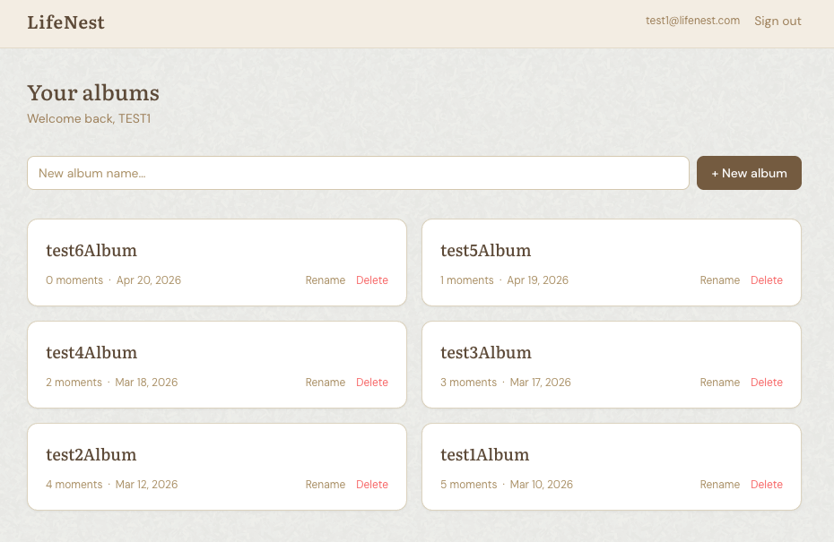
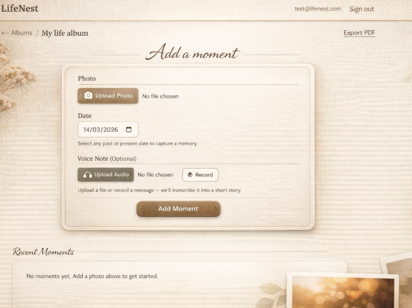
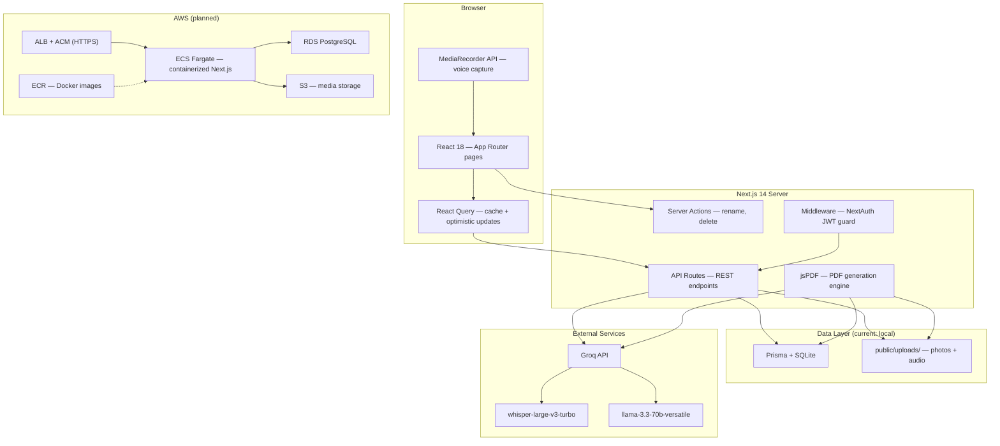

# LifeNest

Privacy-first life albums built from photos and voice notes — the app transcribes your audio with Whisper, rewrites it as a poetic vignette with an LLM, and exports the whole album as a scene-illustrated PDF.


---

## Quick Start

```bash
git clone https://github.com/LaiaRuizM/LifeNest.git && cd LifeNest
cp .env.example .env          # add your GROQ_API_KEY and NEXTAUTH_SECRET
npm install && npm run db:push && npm run db:generate
npm run dev                   # http://localhost:3000
```

Register an account, create an album, upload a photo with a voice note, and watch the transcript turn into a vignette. Hit "Export PDF" to download a printable album with AI-generated cover art and scene watermarks.

---

## What It Does

| Feature | Description |
|---------|-------------|
| Multi-album management | Create, rename, and delete albums. Each album is scoped to the authenticated user. Dashboard shows moment count and creation date per album. |
| Photo + voice capture | Upload a JPG/PNG photo (required) and optionally attach an audio file or record a voice note directly in the browser via MediaRecorder (WebM/Opus). |
| AI transcription | Audio is sent to Groq's `whisper-large-v3-turbo` model. Supports MP3, M4A, and WebM. Retries up to 3 times with exponential backoff on transient network errors. |
| Vignette generation | The raw transcript is rewritten by `llama-3.3-70b-versatile` into a 2-4 sentence poetic vignette. Temperature 0.6, max 200 tokens. Output language matches the transcript. |
| Inline edit and delete | Replace or remove a moment's photo or audio without leaving the album page. New audio triggers re-transcription and a fresh vignette. Delete uses a confirmation step. |
| Optimistic UI | Album creation, renaming, deletion, and moment deletion update the UI instantly via React Query cache manipulation. Rollback on server error. |
| PDF export | Generates an A4 PDF with: AI-themed cover (title, subtitle, color palette derived from vignettes), foreword page, one page per moment with embedded photo, date header, vignette, and transcript. |
| Scene watermarks | Each PDF page gets a content-aware illustration: beach/hawaii, mountains/alps, romance/honeymoon, city/urban, nature/forest, or generic. Drawn at 13% opacity behind content. |
| Backdated moments | Date picker allows any past or present date, so you can capture memories retroactively. |
| Print styles | CSS `@media print` hides the header, toolbar, and decorative elements. Moment cards get a clean, printable layout. |

---

## Features in Action



- Grid of album cards, each showing name, moment count, and creation date
- Inline rename with Enter-to-save
- "New album" form at the top with optimistic placeholder while the server responds



- Cursive "Add a moment" heading with gradient decorative rules
- Paper-textured form card: photo upload, date picker, voice note section (upload or record)
- Recording indicator with live pulse animation; auto-stops on submit
- Moment timeline below: full-width photo, formatted date, serif vignette, collapsible "Show exact words" transcript
- Botanical SVG corner overlays at viewport edges


- Cover page with AI-generated title, subtitle, date range, and keyword tags on a two-tone color split
- Foreword page with italic first-person text generated from the first 20 vignettes
- Moment pages with drop-shadowed photo, date bar, vignette in bold italic, transcript in small body text, and theme badge
- Scene-specific watermarks (palm trees, mountains, hearts, skylines, butterflies) drawn at 13% opacity

---

## Architecture



### How It Works

1. **Sign up / Sign in** — NextAuth credentials provider hashes the password with bcrypt (12 rounds), issues a JWT, and the middleware gates `/dashboard` and `/albums` routes.
2. **Create an album** — POST to `/api/albums` creates a row in `Album`. React Query optimistically prepends it to the dashboard list and navigates to the album page.
3. **Add a moment** — The form collects a photo, an optional audio file or browser recording, and a date. The server saves files to `public/uploads/`, calls Groq Whisper for transcription, then Groq Llama for the vignette, and persists everything in `Moment` + `MomentPhoto`.
4. **Export PDF** — GET `/api/export/pdf?albumId=...` fetches all moments, calls `getAlbumTheme` (analyzes up to 30 vignettes for title/colors), `generateAlbumForeword` (first 20 vignettes), and `getPageDecor` for each moment (all in parallel via `Promise.allSettled`). Then jsPDF assembles cover, foreword, moment pages with embedded base64 photos and scene watermarks, and back cover.

---

## Tech Stack and Skills Demonstrated

| Area | What's Used | Why It Matters |
|------|-------------|----------------|
| Framework | Next.js 14 App Router, React 18, TypeScript 5 (strict) | Server Components, route groups `(auth)` / `(app)`, and co-located API routes demonstrate modern full-stack React architecture |
| State management | TanStack React Query 5 | Optimistic mutations with manual cache manipulation and automatic rollback — not just simple fetching |
| Server mutations | Next.js Server Actions | Rename and delete bypass REST entirely, showing familiarity with the Server Actions pattern alongside traditional API routes |
| Validation | Zod schemas shared client/server | Single source of truth for form shapes; inferred TypeScript types eliminate drift between validation and type system |
| Auth | NextAuth.js 4 (credentials + JWT) | Middleware-based route protection, bcrypt hashing, session callback augmentation for user ID propagation |
| Database | Prisma 5 + SQLite | Relational schema with cascade deletes, one-to-many photo support, and graceful fallback for schema evolution |
| AI integration | Groq API (OpenAI SDK with custom baseURL) | Multi-model orchestration: Whisper for transcription, Llama 3.3 70B for vignettes, theming, forewords, and per-page decoration metadata |
| Resilience | Exponential backoff retry wrapper | Handles ECONNRESET/ETIMEDOUT/ECONNREFUSED across all AI calls; moments are saved even when transcription fails |
| PDF generation | jsPDF with programmatic vector drawing | Custom watermark engine with 6 scene types, base64 image embedding, color math (tint/shade/hex2rgb), and A4 layout |
| Styling | Tailwind CSS 3.4, custom color palette, Google Fonts | Warm earthy "nest" palette (11 shades), DM Sans + Literata font pairing, paper texture background, botanical SVG overlays |
| File handling | UUID-named uploads, FormData, MediaRecorder API | Browser audio capture with WebM/Opus, server-side file storage, path normalization for cross-platform URLs |

---

## Project Structure

```
src/
├── app/
│   ├── (auth)/                     # Public route group
│   │   ├── login/page.tsx          # Email + password sign-in
│   │   ├── register/page.tsx       # Registration with Zod validation
│   │   └── layout.tsx              # Centered, light background
│   ├── (app)/                      # Protected route group
│   │   ├── dashboard/page.tsx      # Album grid with CRUD
│   │   ├── albums/[albumId]/page.tsx  # Moment timeline + form
│   │   └── layout.tsx              # Header with sign-out
│   ├── api/
│   │   ├── auth/[...nextauth]/route.ts
│   │   ├── register/route.ts
│   │   ├── albums/route.ts         # GET (list) + POST (create)
│   │   ├── albums/[albumId]/route.ts  # GET + PATCH + DELETE
│   │   ├── albums/[albumId]/moments/route.ts  # GET + POST (with AI)
│   │   ├── moments/[id]/route.ts   # PATCH + DELETE
│   │   └── export/pdf/route.ts     # Full PDF generation pipeline
│   ├── globals.css                 # Tailwind + paper texture + print styles
│   ├── layout.tsx                  # Root: providers, fonts, env validation
│   └── page.tsx                    # Smart redirect (auth → dashboard)
├── components/
│   └── providers.tsx               # NextAuth SessionProvider + React Query
├── lib/
│   ├── auth.ts                     # NextAuth config (credentials, JWT, callbacks)
│   ├── ai.ts                       # Groq: transcribe, vignette, theme, foreword, decor
│   ├── prisma.ts                   # Singleton Prisma client
│   ├── storage.ts                  # UUID file saving + path resolution
│   ├── schemas.ts                  # Zod schemas + inferred types
│   ├── env.ts                      # Runtime env validation (fails loudly)
│   └── actions/
│       └── album.ts                # Server Actions: rename, delete (with file cleanup)
├── types/
│   └── next-auth.d.ts              # Session type augmentation for user.id
└── middleware.ts                    # NextAuth guard for /dashboard, /albums

prisma/
├── schema.prisma                   # User → Album → Moment → MomentPhoto
└── dev.db                          # SQLite database (gitignored)

public/uploads/                     # User files (gitignored)
├── photos/                         # UUID-named JPG/PNG
└── audio/                          # UUID-named WebM/MP3/M4A
```

---

## Development Phases

| Phase | What Was Built | Status |
|-------|----------------|--------|
| Layer 1 — Foundation | Email/password auth with NextAuth + bcrypt, multi-album routing with dynamic `[albumId]` segments, JWT middleware protecting dashboard and album routes, Prisma schema with User/Album/Moment/MomentPhoto models | Done |
| Layer 2 — State and Validation | Zod schemas shared between client and server, React Query with optimistic create/rename/delete mutations and rollback, Server Actions for album rename and delete, strict TypeScript throughout | Done |
| Layer 3 — UI Polish | Botanical SVG corner decorations, warm paper-fibers texture background, custom "nest" Tailwind color palette, DM Sans + Literata font pairing, `@media print` styles for clean printable output | Done |
| Layer 4 — Bug Fixes | Made entire album card clickable on dashboard (click target expanded from text-only to full card area) | Done |
| Layer 5 — AI Architecture | Prompt engineering pipelines (5 specialized prompts with tuned temperature/max_tokens), concurrency model (`Promise.allSettled` for parallel AI calls during PDF export), failure boundaries (exponential backoff retry, per-call fallbacks, graceful degradation) | Done |
| Layer 6 — AWS Deployment | Containerized Next.js on ECS Fargate, PostgreSQL on RDS (migrate from SQLite), media storage on S3 with presigned URLs (migrate from `public/uploads/`), CI/CD pipeline | In progress |

---

## Design Decisions

| Decision | Rationale |
|----------|-----------|
| Groq over OpenAI | Groq provides the same OpenAI SDK interface but with significantly faster inference for Whisper and Llama. Switching back requires only changing the `baseURL` and API key — no code changes. |
| SQLite over Postgres | Single-file database eliminates setup friction for local development. The schema is Prisma-managed, so migrating to Postgres for production is a one-line `datasource` change. |
| React Query over SWR | `useMutation` with `onMutate`/`onError` hooks provides structured optimistic updates with automatic rollback. SWR's mutation support is less opinionated about cache manipulation. |
| Server Actions alongside REST | Simple mutations (rename, delete) use Server Actions to avoid boilerplate API routes. Complex operations (file uploads, AI pipelines) stay as API routes where FormData and streaming responses are more natural. |
| JWT over database sessions | Stateless sessions avoid an extra DB query per request. The middleware can validate tokens without touching Prisma. Trade-off: no server-side session revocation without a blocklist. |
| jsPDF over Puppeteer/wkhtmltopdf | Pure JS generation runs in the same Node.js process with no headless browser dependency. Enables programmatic vector watermarks that would be CSS hacks in an HTML-to-PDF pipeline. |
| Local file storage over S3 | Keeps the project self-contained for development. Files live in `public/uploads/` and are served by Next.js directly. The `storage.ts` abstraction makes swapping to S3 straightforward. |
| Zod schemas as single source of truth | Inferred TypeScript types (`z.infer<typeof Schema>`) mean validation rules and type definitions can't diverge. Same schema runs on client (instant feedback) and server (authorization). |
| Custom color palette over a component library | A bespoke 11-shade "nest" palette with DM Sans + Literata gives a distinctive, warm aesthetic without the weight of Material UI or Chakra. Tailwind makes this trivial to maintain. |
| `Promise.allSettled` for PDF AI calls | Theme, foreword, and per-page decoration requests fire in parallel. Individual failures fall back gracefully (default palette, generic watermark) rather than failing the entire export. |

---

## Tests

No test suite is configured yet. This is a planned next step — see Roadmap below.

---

## What I Learned

- **Optimistic updates require thinking in snapshots.** The `onMutate` callback needs to capture the previous cache state *before* modifying it, so `onError` can restore it. I initially forgot to `cancelQueries` before snapshotting, which caused race conditions where a background refetch overwrote my optimistic data mid-flight.

- **Groq's OpenAI compatibility is not 100%.** The SDK works with `baseURL` swapped, but Whisper's `file` parameter expects a `File` object constructed from a `Buffer` — passing a raw path or stream fails silently. I had to read the file into a buffer, wrap it in `new File([buf], name, { type: mime })`, and handle the MIME type mapping myself.

- **jsPDF's coordinate system rewards planning on paper first.** The watermark engine (6 scene types, ~300 lines of vector drawing) was impossible to debug by trial and error. I sketched each scene on graph paper with mm coordinates first, then translated to code. The tint/shade helper functions saved hours of manual color math.

- **Server Actions and API routes serve different complexity tiers.** Rename and delete are one-liner mutations that benefit from Server Actions (no fetch boilerplate, automatic revalidation). But file uploads with FormData, AI pipelines, and streaming PDF responses need the full Request/Response control of route handlers. Using both in the same project clarified when each pattern shines.

- **MediaRecorder's `onstop` is asynchronous in a surprising way.** When the user clicks "Add Moment" while still recording, I need to stop the recorder *and wait for the final blob* before constructing the FormData. This required a Promise-based bridge (`audioReadyResolveRef`) between the recorder's `onstop` callback and the form submission handler — a pattern I hadn't seen documented anywhere.

- **Cascade deletes in Prisma don't clean up files.** `onDelete: Cascade` handles the database graph, but orphaned photos and audio files on disk require explicit `unlink` calls in the Server Action. I wrapped these in try/catch with non-fatal logging so a file system error doesn't block the database deletion.

- **AI-generated JSON needs defensive parsing.** Groq's Llama model sometimes wraps JSON in markdown code fences or returns malformed objects. Every `JSON.parse` call in `ai.ts` is wrapped in a cleaner that strips ` ```json ` fences, validates the shape with type guards, and falls back to sensible defaults.

---

## Roadmap

### Active: AWS Deployment

Migration from local-only development to production-grade AWS infrastructure.

| Step | What | Details | Status |
|------|------|---------|--------|
| 6.1 | Dockerize the app | Multi-stage `Dockerfile` (deps → build → runner), `.dockerignore`, `next.config` with `output: 'standalone'` | Pending |
| 6.2 | S3 media storage | Replace `public/uploads/` with `@aws-sdk/client-s3` presigned PUT/GET URLs. Refactor `storage.ts` to write to S3 instead of disk. Serve photos via S3 URLs or CloudFront. | Pending |
| 6.3 | PostgreSQL on RDS | Switch Prisma datasource from `sqlite` to `postgresql`. Create RDS instance, run `prisma migrate deploy`. Update connection string in env. | Pending |
| 6.4 | ECS Fargate service | Create ECR repo, push Docker image. Define ECS task definition (CPU/memory, env vars from Secrets Manager), Fargate service behind an ALB with HTTPS. | Pending |
| 6.5 | CI/CD pipeline | GitHub Actions workflow: lint, build, push to ECR, deploy to ECS. Separate staging/production environments. | Pending |
| 6.6 | DNS + HTTPS | Route 53 domain pointing to ALB. ACM certificate for TLS. | Pending |

### Completed: AI Architecture

Prompt engineering pipelines, concurrency models, and failure boundaries for AI-generated narrative content.

| Step | What | Details | Status |
|------|------|---------|--------|
| 5.1 | Prompt engineering pipelines | 5 specialized prompts in `ai.ts`: transcription (Whisper), vignette (temp 0.6, 200 tokens), album theme (temp 0.5, returns JSON with title/colors/keywords), foreword (temp 0.75, first-person narrative from 20 vignettes), page decoration (temp 0.5, returns theme/icons/mood/accentColor JSON) | Done |
| 5.2 | Concurrency model | `Promise.allSettled` in `export/pdf/route.ts` fires theme + foreword + N per-page decor calls in parallel. Single-moment creation runs transcription → vignette sequentially (vignette depends on transcript). | Done |
| 5.3 | Failure boundaries | `withRetry` wrapper (3 attempts, exponential backoff 1s/2s/3s) catches ECONNRESET, ETIMEDOUT, ECONNREFUSED. `allSettled` isolates per-page failures. Every AI function has a hardcoded fallback: default palette, generic watermark, static foreword. Moments are saved even when transcription fails. | Done |
| 5.4 | Defensive JSON parsing | LLM responses stripped of markdown code fences, validated with type guards, fallback to defaults on malformed output. | Done |
| 5.5 | Multi-model orchestration | Groq API via OpenAI SDK with custom `baseURL`. Whisper `large-v3-turbo` for audio, Llama `3.3-70b-versatile` for all text generation. Swappable to OpenAI by changing one env var. | Done |

### Future

| Item | Details |
|------|---------|
| Usage limits + freemium model | Per-user monthly cap on AI transcriptions (e.g. 30/month free). Track usage in a `UserQuota` table. When the limit is reached, the user can wait for the next cycle or upgrade to a paid tier. Stripe integration for payments. |
| On-device transcription | Accept pre-transcribed text from the phone's native speech-to-text (Siri dictation on iOS, Google Voice on Android) as a free alternative to server-side Whisper. Bypasses the AI quota entirely — the user speaks into their phone's keyboard, and LifeNest receives plain text instead of audio. |
| Mobile app (React Native) | Native iOS/Android app sharing the same API backend. Camera + microphone capture, push notifications for album activity, offline moment drafts synced when back online. |
| Test suite | Vitest + React Testing Library. Unit tests for Zod schemas and `ai.ts` retry logic, integration tests for API routes, component tests for optimistic mutations. |
| Multi-photo gallery | `MomentPhoto` table and `sortOrder` column already exist in the schema. UI needs multi-file picker, drag-to-reorder, and PDF grid layout. |
| Collaborative albums | `AlbumShare` model with unique token. Read-only by default, optional write permission flag. |

---

## License

No license specified. All rights reserved.
